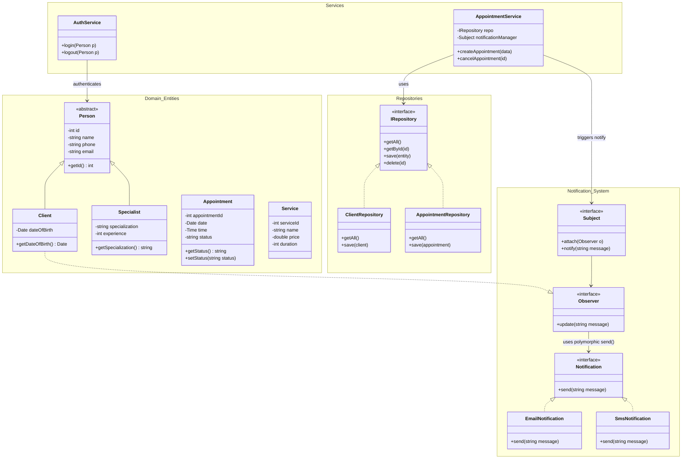

```mermaid
classDiagram
    namespace Domain_Entities {
        class Person {
            <<abstract>>
            -int id
            -string name
            -string phone
            -string email
            +getId() int
        }
        class Client {
            -Date dateOfBirth
            +getDateOfBirth() Date
        }
        class Specialist {
            -string specialization
            -int experience
            +getSpecialization() string
        }
        class Appointment {
            -int appointmentId
            -Date date
            -Time time
            -string status
            +getStatus() string
            +setStatus(string status)
        }
        class Service {
            -int serviceId
            -string name
            -double price
            -int duration
        }
    }

    namespace Services {
        class AuthService {
            +login(Person p)
            +logout(Person p)
        }
        class AppointmentService {
            -IRepository repo
            -Subject notificationManager
            +createAppointment(data)
            +cancelAppointment(id)
        }
    }

    namespace Repositories {
        class IRepository {
            <<interface>>
            +getAll()
            +getById(id)
            +save(entity)
            +delete(id)
        }
        class ClientRepository {
            +getAll()
            +save(client)
        }
        class AppointmentRepository {
            +getAll()
            +save(appointment)
        }
    }

    namespace Notification_System {
        class Observer {
            <<interface>>
            +update(string message)
        }
        class Subject {
            <<interface>>
            +attach(Observer o)
            +notify(string message)
        }
        class Notification {
            <<interface>>
            +send(string message)
        }
        class EmailNotification {
            +send(string message)
        }
        class SmsNotification {
            +send(string message)
        }
    }

    %% Relationships
    Person <|-- Client
    Person <|-- Specialist
    IRepository <|.. ClientRepository
    IRepository <|.. AppointmentRepository
    Notification <|.. EmailNotification
    Notification <|.. SmsNotification
    Client ..|> Observer

    AppointmentService --> IRepository : uses
    AppointmentService --> Subject : triggers notify
    AuthService --> Person : authenticates
    Subject --> Observer
    Observer --> Notification : uses polymorphic send()
```
